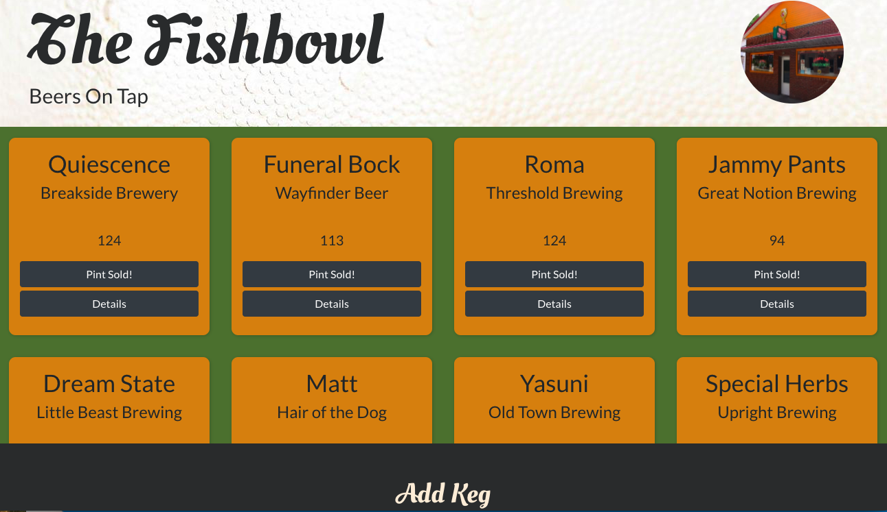

# Taproom 

## React with Redux Code Review for Epicodus
### 09.11.2020
### By Kate Skorija
 

Form to add a keg.

List of kegs, with pints available for each keg and pint sold button.

Details page for each keg.

## Description

This week we learned how to integrate Redux into our React applications, focusing planning where state lives, TDD for reducers, and implementing Redux with single and multiple state slices. This is an app for a tap room, where a user can see all kegs available, view a kegs detail's, add a new keg, delete a keg, and update a keg's information. Users can also keep track of how many pints of a keg are sold. 

This project was bootstrapped with [Create React App](https://github.com/facebook/create-react-app).
  

## Component Diagram

  

## User Stories

*  As a user, I want to see a list/menu of all available kegs. For each keg, I want to see its name, brand, price, alcoholContent, and pints remaining.
*  As a user, I want to submit a form to add a new keg to a list.
*  As a user, I want to be able to click on a keg to see its detail page.
*  As a user, I want to see how many pints are left in a keg. Hint: A full keg has roughly 124 pints.
*  As a user, I want to be able to click a button next to a keg whenever I sell a pint of it. This number should not go below zero.
  

## Known Bugs

The update functionality does not work at this time.  It will not update the selected keg. 
  

## Support and Contact Details

If there are any issues or questions, please reach out to me through [my GitHub account](https://github.com/kate-skorija).
  

## Technologies Used

*  Git
*  CSS
*  JavaScript
*  JSX
*  React
*  Redux
*  Webpack
*  npm
*  Jest
  

## Available Scripts

In the project directory, you can run:

### `npm start`

Runs the app in the development mode. 
Open [http://localhost:3000](http://localhost:3000) to view it in the browser.

The page will reload if you make edits. 
You will also see any lint errors in the console.

### `npm run build`

Builds the app for production to the `build` folder. 
It correctly bundles React in production mode and optimizes the build for the best performance.

The build is minified and the filenames include the hashes. 
Your app is ready to be deployed!

See the section about [deployment](https://facebook.github.io/create-react-app/docs/deployment) for more information.

### `npm run eject`

**Note: this is a one-way operation. Once you `eject`, you can’t go back!**

If you aren’t satisfied with the build tool and configuration choices, you can `eject` at any time. This command will remove the single build dependency from your project.

Instead, it will copy all the configuration files and the transitive dependencies (webpack, Babel, ESLint, etc) right into your project so you have full control over them. All of the commands except `eject` will still work, but they will point to the copied scripts so you can tweak them. At this point you’re on your own.

You don’t have to ever use `eject`. The curated feature set is suitable for small and middle deployments, and you shouldn’t feel obligated to use this feature. However we understand that this tool wouldn’t be useful if you couldn’t customize it when you are ready for it.

## Learn More

You can learn more in the [Create React App documentation](https://facebook.github.io/create-react-app/docs/getting-started).

To learn React, check out the [React documentation](https://reactjs.org/).

### License

*This project uses the following license: [MIT](https://opensource.org/licenses/MIT)*

Copyright (c) 2020 **_Kate Skorija_** 
